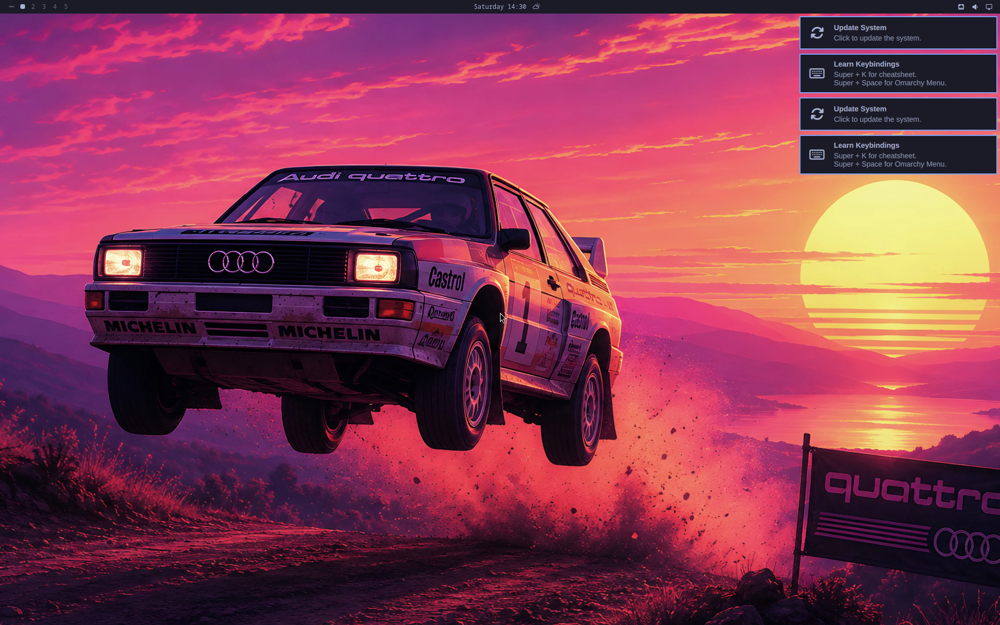

# Omarchy sobre Arch Linux ARM, en UTM para Apple Silicon

> Versión en español. La página de aterrizaje del repositorio es
> [README.md](README.md), en inglés, porque la discusión de la que sale
> este trabajo lo es.

VM **aarch64 nativa** (acelerada con HVF, sin emulación) construida de forma
totalmente automatizada desde macOS: ni un clic en la interfaz de UTM.



| | |
|---|---|
| **Cómo ejecutarlo** | [`EMPEZAR.md`](EMPEZAR.md) · [guía publicada](https://claude.ai/code/artifact/630abf6c-6d3e-4e92-81b2-bfc0a3073c70) |
| **Imagen lista para descargar** | [`omarchy-arm-utm-v2.zip`](https://archive.org/details/omarchy-arm-utm) · 3,6 GB |
| **Construir desde cero** | `./build-omarchy-arm.sh` · ~1 h según la red |
| **Por qué está hecho así** | [`ARTICULO.md`](ARTICULO.md) · [artículo publicado](https://claude.ai/code/artifact/c089d9ed-f880-4324-b601-815b22356d54) |

---

## Por qué no se instala Omarchy tal cual

Omarchy 4 no se puede instalar en ARM64. Verificado contra las fuentes
primarias:

| Comprobación (23-08-2026) | Resultado |
|---|---|
| `stable-mirror.omarchy.org/core/os/aarch64/core.db` | **404** (x86_64 → 200) |
| `install/post-install/pacman.sh` | sobrescribe el mirrorlist con `stable-mirror.omarchy.org/$repo/os/$arch` |
| `omarchy.org/install-bare` (de la guía #452) | **404**, eliminado |
| `omacom-io/omarchy-iso` → `plans/aarch64-support.md` | ARM64 = plan **sin implementar** |

El instalador apunta pacman a un espejo sin árbol aarch64, así que en ARM el
primer `pacman -Syu` falla. El árbol de Omarchy en sí es agnóstico de
arquitectura: son scripts, Lua y QML.

**Una corrección que conviene hacer**, porque se repite mucho: Omarchy 3.x sí
tenía un guard explícito —`install/preflight/guard.sh:25`, `[[ $(uname -m) !=
"x86_64" ]] && abort`—. **Quattro no.** El directorio `preflight/` ha
desaparecido y `uname -m` aparece **cero veces** en toda la rama. El bloqueo pasó
de «se niega» a «no hay repositorio del que instalar», que es un problema mucho
menor: lo cerraría publicar unos 25 paquetes aarch64.

Por eso aquí se monta la base equivalente —Arch Linux ARM + Hyprland— y se le
aplica el **contenido real** del repositorio de Omarchy.

## La trampa: la rama por defecto es `quattro`, no `master`

`git clone` de `basecamp/omarchy` **no trae `master`** (3.8.5) sino la rama por
defecto **`quattro`** (4.0.0.alpha). Son dos productos distintos:

| | `master` (3.8.5) | `quattro` (4.x) |
|---|---|---|
| Barra | waybar | **quickshell** (`omarchy-shell`) |
| Config de Hyprland | `.conf` | **Lua** (`hyprland.lua`, `bootstrap.lua`) |
| Distribución | scripts en `~/.local/share` | **paquete pacman** en `/usr/share/omarchy` |

El paquete en sí es **`arch=('any')`** —scripts, Lua y QML—. Lo que es
x86_64-only es el *repositorio* donde se publica, así que en ARM no puedes
`pacman -S omarchy` y los ficheros nunca llegan. Copiando solo los dotfiles,
`OMARCHY_PATH` queda sin definir, el `bashrc` da error, Hyprland no encuentra
`bootstrap.lua` y te quedas con un compositor pelado en vez de un escritorio.
`stage3.sh` replica a mano lo que habría instalado ese paquete, en `/usr/bin`
—el mismo sitio que usa upstream—. Una versión anterior los ponía en
`/usr/local/bin`, que parecía más limpio pero rompía cosas: el árbol lleva trece
rutas `/usr/bin/omarchy-*` cableadas, cinco en ficheros `.service`.
`/usr/local/bin` se sigue usando, pero sólo para los pocos envoltorios propios
de ARM que necesitan precedencia en el `PATH`.

## Qué contiene la imagen

- **Arch Linux ARM** aarch64, kernel `linux-aarch64` 7.2, btrfs con subvolúmenes
  `@` y `@home`, compresión zstd, ESP de 1 GiB, systemd-boot
- **Hyprland 0.56.1** con el stack de Omarchy 4: quickshell —que es a la vez
  barra, menú, OSD y demonio de notificaciones—, hyprlock, hypridle, hyprsunset,
  uwsm, xdg-desktop-portal-hyprland, SDDM con autologin y tema Omarchy
- **Dotfiles, temas y los 432 comandos `omarchy-*`**, en `/usr/bin` como hace
  el paquete de upstream
- **17 herramientas de Omarchy construidas para aarch64** que no se publican
  para ARM: `tensaku`, `omacalc`, `omacut`, `omawrite`, `aether`, `cliamp`,
  `ttfx`, `omarchy-nvim`, `mise`, `tzupdate`, `yaru-icon-theme`,
  `ttf-ia-writer`, `hyprland-preview-share-picker`, `xdg-terminal-exec`,
  `tobi-try`, `ufw-docker` y `yay`. (`quickshell` no está aquí: sí existe en los
  repos de Arch Linux ARM y se instala como paquete normal.)
- **OBS Studio 32.2.2 y Pinta 3.1.2** compilados para ARM (software libre, sí
  van dentro)
- Integración con el host: `qemu-guest-agent` (habilita `utmctl exec`,
  `ip-address`, `file`) y `spice-vdagent`

De los 148 paquetes de `omarchy-base.packages`, **121 existen en Arch Linux
ARM** por nombre (123 si sustituyes `nvim`→`neovim` y
`ttf-jetbrains-mono-nerd-basic`→`ttf-jetbrains-mono-nerd`). De los que faltan,
**17 se compilan desde fuente**. Quedan fuera las
apps propietarias (1Password, Spotify, Obsidian, Typora) y `herdr`, que necesita la semántica de
Zig 0.15: ni ARM ni x86_64 empaquetan ya esa versión, los dos van por la 0.16.

Y algo que tardé en ver: **no todo lo que falta hay que compilarlo**. `mako`,
`swayosd`, `walker` y `elephant` los instalé por inercia de Omarchy 3, y
`quattro` los jubila a propósito —el shell de quickshell hace ese trabajo—. Peor
aún, `mako` se activa por D-Bus y le roba `org.freedesktop.Notifications` al
shell, dejando las notificaciones sin tema.

## Fallo conocido en la imagen publicada

La imagen que hay en el Internet Archive instala los comandos `omarchy-*` en
`/usr/local/bin`. Fue decisión mía —el paquete de upstream usa `/usr/bin`— y
resulta que el árbol lleva trece rutas `/usr/bin/omarchy-*` cableadas, cinco de
ellas en ficheros `.service`. Se nota en dos sitios:

- **«Update System» reaparece en cada arranque**, aunque todo esté al día.
  `enable-user-units.sh` falla, y `omarchy-provision-first-run` sólo marca
  first-run como hecho si *ningún* paso falla: se repite indefinidamente y
  vuelve a lanzar el aviso.
- **«Linux kernel has been updated. Reboot?» en cada actualización.** Causa
  distinta: `omarchy-update-restart` busca un `/usr/lib/modules/<ver>/vmlinuz`
  que pertenezca a un paquete. En x86_64 lo instala `linux`; en Arch Linux ARM,
  `linux-aarch64` deja la imagen en `/boot/Image` y no crea ese fichero, así que
  la condición nunca se cumple y reiniciar no sirve de nada.

Debajo de los dos había un tercero: los seis ficheros `.service` de usuario
nunca se instalaron en `/usr/lib/systemd/user/`. Upstream los reparte con el
paquete `omarchy-settings`, que no tiene build ARM, y el primer build no
replicaba ese paso — así que `enable-user-units.sh` no podía funcionar por
muchas rutas que se arreglaran.

**Los tres están corregidos en `omarchy-arm-utm-v2.zip`** (3,6 GB, un 45% menos
que la primera). Para arreglar una VM que ya tengas, sin volver a descargar,
ejecuta dentro [`fixes/18-avisos-que-no-se-apagan.sh`](fixes/18-avisos-que-no-se-apagan.sh).

## Uso

```bash
./build-omarchy-arm.sh              # pregunta lo justo y construye
./build-omarchy-arm.sh --yes        # desatendido, con los valores por defecto
./build-omarchy-arm.sh --from build # reanudar desde una fase (no pregunta)
./build-omarchy-arm.sh --list       # ver las fases
```

Fases: `deps`, `fetch`, `prepare`, `build`, `utm`, `verify`, `sanitize`,
`package`.

Con terminal pregunta seis cosas, todas prerrellenadas con lo que detecta del
Mac —zona horaria de `/etc/localtime`, teclado de las preferencias de macOS,
núcleos y RAM de `sysctl`—, así que se contestan con Enter. Las dos que
realmente cambian el resultado son si compilar las herramientas (~40 min) y si
preparar la imagen para repartir; si eliges «VM para ti», se salta `sanitize` y
`package` y conserva tu usuario. Sin terminal, o con `--yes`, no pregunta nada:
el modo desatendido de siempre sigue intacto.

La fase `prepare` calcula la lista de paquetes en cada ejecución, cruzando la
rama viva de Omarchy con el índice de Arch Linux ARM. Así el build no se rompe
cuando Omarchy cambie de paquetes —que lo hará— y de paso informa de qué se ha
quedado fuera.

Credenciales durante la construcción: `builder` / `builder` (se preguntan). En
la imagen distribuible se renombra a `omarchy` / `omarchy`.

## Portapapeles y carpeta compartida

**El «Compartir portapapeles» de UTM no funciona en Hyprland**, y conviene saber
por qué, porque hay dos barreras y sólo la segunda es insalvable:

1. `spice-vdagentd` sólo enruta el portapapeles al agente de la **sesión activa
   de `seat0`** (`src/vdagentd/systemd-login.c:272`); si no la encuentra,
   descarta el mensaje en silencio. Esto se puede sortear con el flag `-X`.
2. Pero aunque el mensaje pase, el destino final es X11: `vdagent.c:421` hace
   `vdagent_clipboards_new(vdagent_display_get_x11(...))`, y en todo el
   repositorio no hay una sola referencia a `wlr-data-control`. Bajo Wayland
   nativo no hay por dónde hablar con el compositor.

Es decir: da igual que el servicio arranque, y da igual el `-X`. Hay parches de
terceros en revisión desde 2025 (el MR !57 de SPICE lleva un año sin que ningún
mantenedor lo revise) pero nada que se pueda dar por bueno hoy.

La imagen trae dos cosas para suplirlo:

- **`/mnt/share`** — la carpeta que compartas en *Ajustes de la VM → Compartir*
  se monta sola ahí. Es la vía sencilla para pasar ficheros.
- **`omarchy-arm-clipboard`** — un puente de portapapeles que usa esa misma
  carpeta. Dentro de la VM:

  ```bash
  omarchy-arm-clipboard --install   # servicio de usuario, arranca con la sesión
  omarchy-arm-clipboard --host      # imprime el script para el Mac
  ```

  El script del Mac se ejecuta en el anfitrión apuntando a la carpeta
  compartida. Sincroniza texto en las dos direcciones, una vez por segundo.
  Sólo texto: ni imágenes ni ficheros.

## Actualizaciones

`omarchy-update` funciona, pero necesitó tres arreglos que no son evidentes:

- **`omarchy-update-dev` sale sin hacer nada** cuando `OMARCHY_PATH` es
  `/usr/share/omarchy`, porque asume el paquete pacman. Aquí hay un checkout de
  git, así que sin un hook `post-update.d/10-arm-sync` el árbol de Omarchy se
  congela mientras el resto del sistema sí se actualiza.
- **Sin `snapper` no hay instantánea previa**: `omarchy-snapshot` devuelve 127 y
  la actualización sigue sin red de seguridad. Se instala y se configura con el
  propio `install/config/snapper.sh` de Omarchy.
- **El envoltorio de `omarchy-pkg-add` debe ser un fichero real**, nunca escrito
  con `tee` sobre la ruta de `/usr/local/bin`: ahí hay un symlink al árbol y
  `tee` lo sigue, reemplazando el script original por el envoltorio, cuyo
  `REAL=` pasa a apuntar a sí mismo. Bucle infinito.

Con systemd-boot no hay selección de snapshot en el arranque —eso lo aporta
`limine-snapper-sync`— pero las instantáneas se recuperan con `snapper rollback`.

## Apps que no vienen dentro

1Password, Obsidian, Typora, LocalSend y Chrome **no se incluyen en la imagen**
por licencia, no por incompatibilidad: todas tienen build ARM64 oficial. La
imagen trae un instalador que las baja de su fuente oficial:

```bash
omarchy-arm-extras --list     # ver qué puede instalar
omarchy-arm-extras            # menú interactivo
omarchy-arm-extras --all      # todas
```

También aparece en el menú de aplicaciones como «Instalar apps que faltan (ARM)».

Spotify no tiene cliente nativo ARM, pero la web sí funciona: necesita Widevine,
que viene dentro de Google Chrome arm64 (`omarchy-arm-extras chrome spotify-web`).

## Estructura

```
build-omarchy-arm.sh   script autónomo con las piezas embebidas
EMPEZAR.md             guía para ejecutarlo: requisitos y resolución de problemas
ARTICULO.md            explicación paso a paso de cómo se llegó hasta aquí
articulo.html          la misma, como página
dist/                  omarchy-arm-utm.zip + sha256 + LEEME para el destinatario
dl/                    Alpine virt ISO + rootfs de ALARM (MD5 verificado)
provision/src/         stage1..3.sh repair.sh sanitize.sh omarchy-arm-extras hooks/
scripts/               qemu-build.sh build.exp repair.exp make-utm.sh qemu-shot.sh omssh
fixes/                 correcciones aplicadas post-build (ya en stage2/3)
shots/                 capturas de verificación
vm/                    disco de construcción + efi-vars.fd
logs/
```

## Las tres etapas

1. **stage1.sh** — live de Alpine (busybox ash). Carga módulos (`btrfs`, `vfat`,
   con *fallback* a ext4), particiona GPT, crea los subvolúmenes, despliega el
   rootfs con `bsdtar -xpf` y entra en chroot.
2. **stage2.sh** — chroot, como root. Llavero de ALARM, `pacman -Syu`, base,
   locale/zona/teclado, usuario, fstab, mkinitcpio con módulos virtio,
   systemd-boot, paquetes núcleo + extras, SDDM.
3. **stage3.sh** — como usuario. Clona `quattro`, copia dotfiles, **replica el
   paquete pacman en las rutas de sistema**, compila las herramientas ausentes,
   aplica el tema y ajusta la configuración para VM.

## Detalles que costaron encontrar

- **La ESP se monta después de extraer el rootfs.** El tarball de ALARM trae
  symlinks en `/boot` y vfat no los admite; el kernel lo repuebla pacman.
- **`bootctl install --no-variables`.** La NVRAM de la VM de construcción no
  viaja a UTM, así que el arranque depende de la ruta de reserva
  `\EFI\BOOT\BOOTAA64.EFI`, que systemd-boot instala igualmente.
- **El bundle `.utm` se escribe a mano.** `utmctl` no crea VMs y UTM solo escanea
  `Documents/` al arrancar la app. El `config.plist` necesita las **diez** claves
  de primer nivel: se decodifican con `decode()`, no `decodeIfPresent()`.
- **La mitad VARS del UEFI aarch64 es `edk2-arm-vars.fd`**, no
  `edk2-aarch64-vars.fd` (que no existe). La CODE la aporta UTM vía `-L`.
- **Los clientes GPU no se pintan bajo virgl.** Se mapean pero quedan vacíos;
  solo renderizan los que usan `wl_shm`. Se resuelve con
  `LIBGL_ALWAYS_SOFTWARE=1` a costa de la aceleración GL dentro de la VM.
- **Cambiar la resolución en caliente rompe el renderizado**: la pantalla se
  queda en blanco hasta reiniciar. Aplicada desde el arranque funciona.
- **Option (⌥) actúa como SUPER** vía `altwin:swap_lalt_lwin`, porque macOS
  intercepta Cmd antes de que UTM lo reciba.
- **Sellar las migraciones de Omarchy.** Un instalador normal las marca todas al
  terminar; sin eso `omarchy-update` intenta reproducir ~80 migraciones
  históricas y muere en la primera que toca un paquete x86-only.
- **El live de Alpine no carga `btrfs` solo**: hay que hacer `modprobe`. Montar
  btrfs no necesita `btrfs-progs`, solo el módulo.
- **Un pipe a `tee` enmascara el código de salida.** Los scripts emiten su propio
  token `TOK_*_<rc>` en vez de fiarse de `$?` tras el pipe.
- **`grep -r` no ve el destino de un symlink.** Tras renombrar el usuario, el
  barrido de texto daba cero coincidencias mientras quedaban **439 enlaces
  colgando** —incluidos los 431 comandos `omarchy-*`—. Se detectan con
  `find -type l -lname`, no con `grep`.
- **La lista de paquetes de una distro es una afirmación sobre su arquitectura.**
  Completarla «de memoria» con la versión anterior reintroduce componentes que la
  nueva sustituyó a propósito.
- **Un mensaje de éxito que no depende de nada.** Con `set -uo pipefail` sin
  `-e`, una función devuelve el estado de su último comando —casi siempre un
  `echo` de confirmación—. Cuatro de las ocho fases eran así: incapaces de
  fallar. Se encuentran buscando `|| warn` y `| tail` antes de un `ok`.
- **`bash -n` valida sintaxis, no versión.** `${var,,}` es de bash 4 y macOS
  trae la 3.2, donde un error de expansión aborta la función entera. Solo
  aparece ejecutando contra un pty de verdad.
- **Entrecomilla siempre los valores de un fichero que se va a `source`.**
  `VM_FULLNAME=Omarchy ARM` ejecuta `ARM` como comando.

### Al compilar paquetes para ARM

- **Un único `local` expande todos los valores antes de asignar ninguno**: con
  `set -u`, `local a="$1" b="$WORK/$a"` aborta porque `$a` aún no existe.
- **`arch=(any)` puede venir sin comillas**; añadirle `aarch64` hace que makepkg
  rechace la mezcla.
- **Las URL de AUR usan el `PackageBase`**, que no siempre es el nombre del
  paquete: `yaru-icon-theme` vive en el repo `yaru`.
- **Un PKGBUILD puede generar varios subpaquetes** y que solo uno tenga una
  dependencia ausente. Hay que compilar sin instalar e instalar el concreto.
- **Muchos PKGBUILD declaran `arch=(x86_64)` por omisión**, no por
  incompatibilidad. Si es Rust, Go o C++ portable, basta con añadir la
  arquitectura.

## Nota

Trabajo no oficial, sin relación con Basecamp ni con el proyecto Omarchy.
Omarchy soporta x86_64; cuando publiquen el ISO aarch64 que ya tienen
planificado, esto dejará de hacer falta.

## Licencia

[MIT](LICENSE) para el codigo de este repositorio. Omarchy, Arch Linux ARM,
Hyprland y el resto de componentes conservan las suyas. La imagen no incluye
software propietario.
